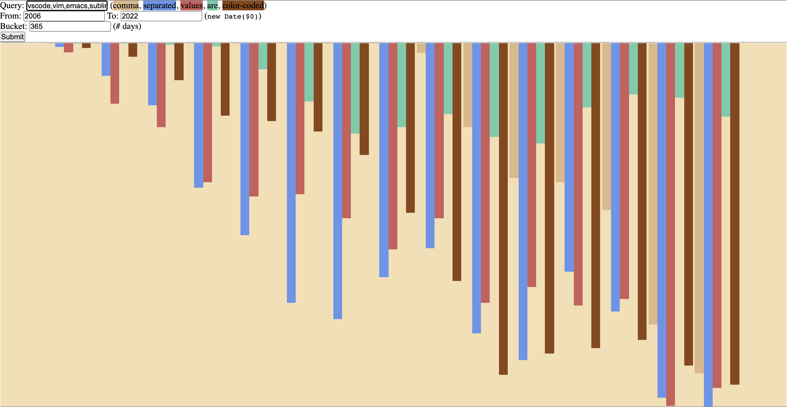
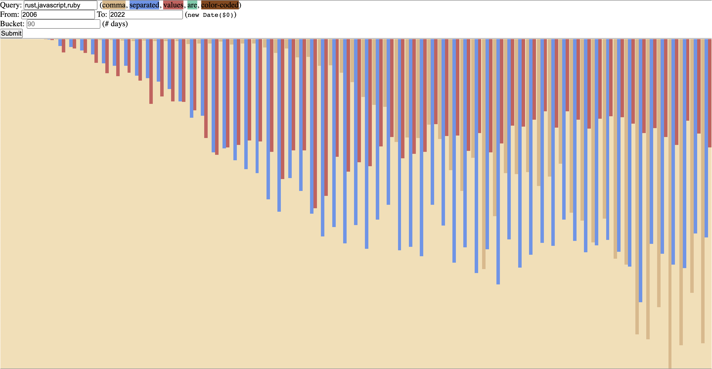

# HackerTrends

Google Trends, but for HN comments, in less than 128 lines of HTML. [Try it now!](https://jacksonkearl.github.io/HackerTrends)

Powered by Agolia's [Hacker News Search API](https://hn.algolia.com/api).

## Why?

Someone asked if the from "So you think", followed by a strawman argument, was a pattern new to HN.

I tried to deduce this using Agolia's [HN search page](https://hn.algolia.com/), but their date picker implementation made such querying painful.

Luckliy, Agolia provides a CORS-friendly API to their search engine, and I was going to be in flights all afternoon, so I got high and crafted an answerer to the question.

### The Answer

Inconclusive. Try for yourself: https://jacksonkearl.github.io/HackerTrends/?query=%22so+you+think%22%2Cstrawman&from=2006&to=2022&bucket=90

## Examples

Editor wars [(vscode, vim, emacs, sublime, atom)](https://jacksonkearl.github.io/HackerTrends/?query=vscode%2Cvim%2Cemacs%2Csublime%2Catom&from=2006&to=2022&bucket=90):

Language wars [(rust, javascript, ruby)](https://jacksonkearl.github.io/HackerTrends/?query=rust%2Cjavascript%2Cruby&from=7%2F7%2F2010&to=2021-12-25&bucket=90):
